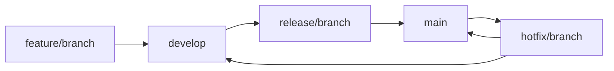

# Version Management for yimi-rutool

<div align="center">
  <h3>🌍 Language / 语言</h3>
  <p>
    <a href="VERSION_MANAGEMENT.md">中文</a> •
    <a href="VERSION_MANAGEMENT-EN.md">English</a>
  </p>
</div>

This document describes the comprehensive version management system implemented for the yimi-rutool project.

## 🎯 Overview

The version management system provides automated, consistent, and reliable version control for the yimi-rutool Rust utility library. It includes automated version bumping, changelog generation, release preparation, and deployment processes.

## 🏗️ System Architecture

### Core Components

1. **Unified Changelog System**
   - Single `CHANGELOG.md` file for all version history
   - Bilingual support (Chinese/English)
   - Automated generation and updates

2. **Automated Release Tools**
   - `cargo-release` integration
   - Automated version bumping
   - Automated changelog updates
   - Automated git tagging

3. **CI/CD Integration**
   - GitHub Actions workflows
   - Automated testing and validation
   - Automated deployment to crates.io

4. **Branch Management**
   - Git Flow-based branching strategy
   - Automated branch protection
   - Automated merge workflows

## 📋 Features

### ✅ Implemented Features

- **Unified Changelog**: Single `CHANGELOG.md` with complete version history
- **Bilingual Documentation**: Chinese and English versions of all documentation
- **Automated Release**: `cargo-release` integration with automated workflows
- **Conventional Commits**: Standardized commit message format
- **CI/CD Pipeline**: GitHub Actions for automated testing and deployment
- **Branch Strategy**: Git Flow-based branching with protection rules
- **Release Checklist**: Comprehensive pre-release validation
- **Version Management**: Automated version bumping and tagging
- **Security Integration**: Automated security auditing
- **Documentation Management**: Automated documentation updates

### 🔧 Technical Implementation

#### 1. Changelog Management
```bash
# Structure
CHANGELOG.md          # Chinese version
CHANGELOG-EN.md       # English version
```

#### 2. Release Automation
```bash
# Configuration
.cargo-release.toml   # cargo-release configuration
scripts/release.sh    # Release automation script
```

#### 3. CI/CD Workflows
```bash
# GitHub Actions
.github/workflows/ci.yml      # Continuous integration
.github/workflows/release.yml # Release automation
```

#### 4. Documentation System
```bash
# Bilingual support
docs/language-config.json     # Language configuration
scripts/language-manager.sh   # Language management script
```

## 🚀 Usage

### Automated Release Process

#### 1. Patch Release (Bug Fixes)
```bash
# Automated patch release
./scripts/release.sh patch

# Dry run to preview changes
./scripts/release.sh patch --dry-run
```

#### 2. Minor Release (New Features)
```bash
# Automated minor release
./scripts/release.sh minor

# Dry run to preview changes
./scripts/release.sh minor --dry-run
```

#### 3. Major Release (Breaking Changes)
```bash
# Automated major release
./scripts/release.sh major

# Dry run to preview changes
./scripts/release.sh major --dry-run
```

### Manual Release Process

#### 1. Using cargo-release
```bash
# Check release readiness
cargo release check

# Perform patch release
cargo release patch

# Perform minor release
cargo release minor

# Perform major release
cargo release major
```

#### 2. Using GitHub Actions
```bash
# Trigger release workflow
git tag v0.2.5
git push origin v0.2.5
```

## 📊 Version Numbering

### Semantic Versioning (SemVer)

The project follows [Semantic Versioning](https://semver.org/) specification:

- **MAJOR** (X.0.0): Incompatible API changes
- **MINOR** (0.X.0): New functionality in a backwards compatible manner
- **PATCH** (0.0.X): Backwards compatible bug fixes

### Version Examples

```bash
# Patch releases (bug fixes)
0.2.3 → 0.2.4 → 0.2.5

# Minor releases (new features)
0.2.5 → 0.3.0 → 0.4.0

# Major releases (breaking changes)
0.4.0 → 1.0.0 → 2.0.0
```

## 📝 Commit Message Convention

### Conventional Commits Format

```
<type>[optional scope]: <description>

[optional body]

[optional footer(s)]
```

### Commit Types

- **feat**: New features
- **fix**: Bug fixes
- **docs**: Documentation changes
- **style**: Code style changes
- **refactor**: Code refactoring
- **perf**: Performance improvements
- **test**: Test changes
- **chore**: Maintenance tasks
- **ci**: CI/CD changes
- **build**: Build system changes
- **revert**: Revert previous commits

### Examples

```bash
# Feature
feat(algorithms): add bloom filter implementation

# Bug fix
fix(crypto): resolve RSA timing vulnerability

# Documentation
docs: update API documentation for text module

# Performance improvement
perf(cache): optimize LRU cache performance

# Breaking change
feat(http)!: change default timeout to 60 seconds

BREAKING CHANGE: HTTP client default timeout changed from 30s to 60s
```

## 🌿 Branch Strategy

### Branch Types

1. **main**: Production-ready code
2. **develop**: Integration branch for features
3. **feature/***: Feature development branches
4. **fix/***: Bug fix branches
5. **release/***: Release preparation branches
6. **hotfix/***: Critical production fixes

### Workflow



## 🔄 Release Workflow

### 1. Development Phase
```bash
# Create feature branch
git checkout -b feature/new-feature

# Develop and commit
git commit -m "feat: implement new feature"

# Push and create PR
git push origin feature/new-feature
```

### 2. Integration Phase
```bash
# Merge to develop
git checkout develop
git merge feature/new-feature

# Run integration tests
cargo test
cargo clippy
cargo audit
```

### 3. Release Preparation
```bash
# Create release branch
git checkout -b release/0.2.4

# Update changelog
# Update version numbers
# Final testing

# Merge to main
git checkout main
git merge release/0.2.4
git tag -a v0.2.4 -m "Release version 0.2.4"
```

### 4. Deployment Phase
```bash
# Push to remote
git push origin main --tags

# Automated deployment via GitHub Actions
# Package published to crates.io
# Documentation updated on docs.rs
```

## 🛠️ Tools and Scripts

### Release Script (`scripts/release.sh`)

```bash
#!/bin/bash
# Automated release script with validation

# Check prerequisites
check_prerequisites() {
    # Check git status
    # Check cargo-release installation
    # Check test status
}

# Run release
run_release() {
    # Update version
    # Update changelog
    # Create git tag
    # Push changes
}
```

### Language Manager (`scripts/language-manager.sh`)

```bash
#!/bin/bash
# Bilingual documentation management

# List supported languages
list_languages() {
    # Show available languages
}

# Check file integrity
check_integrity() {
    # Verify all language files exist
}

# Update language switchers
update_switchers() {
    # Update language links in all files
}
```

## 📊 Quality Assurance

### Pre-Release Checks

1. **Code Quality**
   - All tests pass (`cargo test`)
   - Documentation tests pass (`cargo test --doc`)
   - Clippy passes with no warnings
   - Code is properly formatted
   - Security audit is clean

2. **Documentation**
   - README is up to date
   - CHANGELOG is updated
   - API documentation is complete
   - Examples are working

3. **Security**
   - Security audit passes
   - No known vulnerabilities
   - Dependencies are up to date
   - Input validation is comprehensive

### Automated Validation

```yaml
# .github/workflows/ci.yml
name: CI
on: [push, pull_request]
jobs:
  test:
    runs-on: ubuntu-latest
    steps:
      - uses: actions/checkout@v3
      - uses: actions-rs/toolchain@v1
      - run: cargo test
      - run: cargo clippy
      - run: cargo audit
```

## 🔒 Security Integration

### Automated Security Scanning

1. **Dependency Audit**
   ```bash
   cargo audit
   ```

2. **Vulnerability Scanning**
   - Automated scanning in CI/CD
   - Alert system for new vulnerabilities
   - Automated dependency updates

3. **Security Documentation**
   - Security audit reports
   - Vulnerability tracking
   - Security best practices

## 📈 Metrics and Monitoring

### Release Metrics

- **Release Frequency**: Regular, predictable releases
- **Quality Metrics**: Test coverage, bug rate, performance
- **User Satisfaction**: Feedback and adoption rates
- **Security Metrics**: Vulnerability response time

### Monitoring

- **Automated Testing**: Continuous integration
- **Performance Monitoring**: Benchmark tracking
- **Security Monitoring**: Vulnerability alerts
- **Documentation Monitoring**: Link checking, accuracy

## 🚨 Emergency Procedures

### Critical Bug Response

1. **Immediate Assessment**
   - Severity evaluation
   - Impact assessment
   - User notification

2. **Hotfix Process**
   - Create hotfix branch
   - Implement minimal fix
   - Fast-track testing
   - Deploy immediately

3. **Post-Hotfix**
   - Root cause analysis
   - Comprehensive fix
   - Process improvement

### Rollback Procedures

1. **Assessment**
   - Identify problematic version
   - Evaluate rollback impact
   - Plan rollback strategy

2. **Execution**
   - Create revert commit
   - Test revert thoroughly
   - Deploy revert
   - Notify users

## 📚 Documentation

### User Documentation

- **README.md**: Project overview and quick start
- **CHANGELOG.md**: Version history and changes
- **API Documentation**: Complete API reference
- **Examples**: Usage examples and tutorials

### Developer Documentation

- **CONTRIBUTING.md**: Contribution guidelines
- **BRANCH_STRATEGY.md**: Branching and workflow
- **RELEASE_CHECKLIST.md**: Release preparation
- **VERSION_MANAGEMENT.md**: This document

### Bilingual Support

- **Language Switcher**: Easy navigation between languages
- **Consistent Content**: Synchronized Chinese and English versions
- **Automated Management**: Scripts for maintaining consistency

## 🔮 Future Enhancements

### Planned Features

1. **Advanced Automation**
   - Automated dependency updates
   - Automated security patches
   - Automated performance monitoring

2. **Enhanced Documentation**
   - Interactive documentation
   - Video tutorials
   - Community contributions

3. **Improved CI/CD**
   - Multi-platform testing
   - Performance benchmarking
   - Automated rollback capabilities

4. **Community Features**
   - Contributor recognition
   - Community feedback integration
   - User analytics

## 📞 Support and Maintenance

### Getting Help

- **GitHub Issues**: Bug reports and feature requests
- **GitHub Discussions**: Questions and general discussion
- **Documentation**: Comprehensive guides and references
- **Community**: Active community support

### Maintenance

- **Regular Updates**: Dependencies and security patches
- **Performance Monitoring**: Continuous optimization
- **Documentation Updates**: Keeping content current
- **Community Engagement**: Active support and feedback

This version management system ensures consistent, reliable, and high-quality releases while maintaining excellent developer and user experiences.
